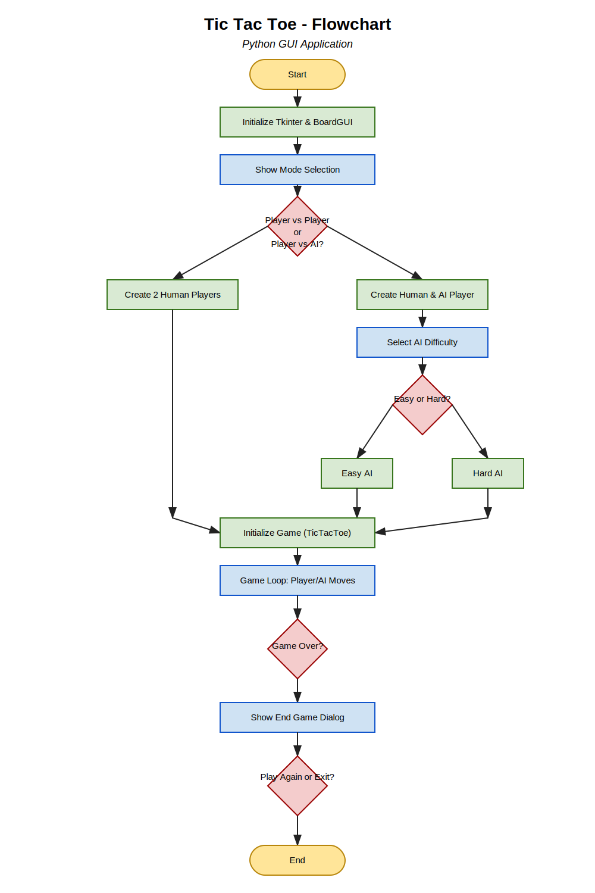

# Tic Tac Toe

A professional, modular Tic Tac Toe game built with Python and Tkinter.  
Features include Player vs Player and Player vs AI modes, AI difficulty selection, score tracking, replay options, and window centering for a polished user experience.

## Features

- **Player vs Player** and **Player vs AI** modes
- **AI difficulty**: Easy (random) or Hard (minimax algorithm)
- **Scoreboard**: Tracks wins and draws
- **Replay, Main Menu, and Exit** options after each game
- **Window centering** for all main and dialog windows
- **Modular codebase**: separated into game logic, player logic, GUI, and entry point

## Requirements

- Python 3.7+
- Tkinter (comes standard with most Python installations)

## How to Run

1. Clone this repository:

   ```bash
   git clone https://github.com/awakra/Tic-Tac-Toe.git
   ```

2. Run the application:
   ```bash
   python main.py
   ```

## Project Structure

```
tic-tac-toe-python-gui/
│
├── main.py         # Entry point
├── gui.py          # GUI logic (Tkinter)
├── game.py         # Game logic (TicTacToe class)
├── player.py       # Player and AIPlayer classes
└── README.md       # Project documentation
```

## Usage

- On launch, choose between **Player vs Player** or **Player vs AI**.
- If you select AI, choose the difficulty level.
- Play the game using the graphical interface.
- After each game, choose to play again, return to the main menu, or exit.
- The scoreboard is updated automatically.

---

## Flowchart



---
